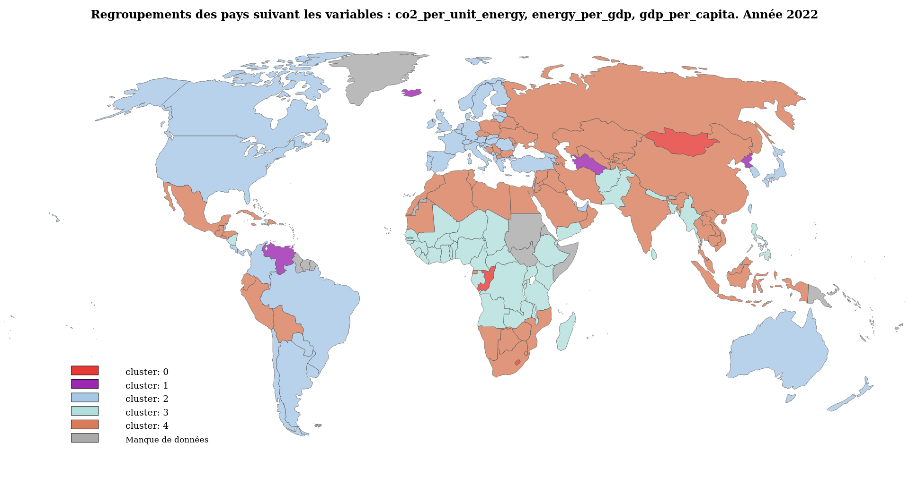

# 🗺️ Catégorisation des pays par divers indicateurs économiques et d'émissions carbone 🗺️

## Apprentisage non supervisé, clustering

## 🎯 Objectifs :

L'objectif est de proposer une classification des pays en les regroupant en fonction des critères:

- carbonation du mix énergétique
- efficacité énergétique
- produit intérieur brut par habitant
- population

Plutôt que de ne considérer que les émissions de $CO\_{2}$, qui ne rendent pas compte des particularités de chaque pays, il s'agit de les décomposer en variables en s'inspirant de l'identité de Kaya :


$$
\text{CO}_{2}[\text{kg}] = \frac{\text{CO}_{2}[\text{kg}]}{\text{energy}[\text{kWh}]} * \frac{\text{energy}[\text{kWh}]}{\text{gdp}[\text{＄}]} * \frac{\text{gdp}[\text{＄}]}{\text{population}} * \text{population}
$$

## Demo : [carte du monde](https://c-vellen.github.io/CO2-energy-gdp-by-country/)

## Exemple de clustering :



## ⛃ Datasets (src/data):

Données utilisées pour la modélisation:

- **owid-co2-data.csv** : données brutes téléchargées du [Site our World in Data](https://github.com/owid/co2-data)
- **kaya-dataset.csv** : données préparées avec retrait et ajout de colonnes.
- **world_map.json** : carte du monde
- **countries_list.txt** : liste de la colonne "country" : pays, continent, divers,...

## 📝 Notebooks (src/notebooks):

**1-dataset-construction.ipynb** :

- récupération du dataset :

```bash
    data/owid-co2-codebook.csv
```

- nettoyage des colonnes superflues, construction des colonnes : 
  - $\text{CO}_{2}[\text{Mt}]$ : Annual total CO2 emission from burning fossil fuels and industrial processes. Includes : transport, energy production, heating. Excludes : land-use change (impact of deforestation).
  - $\text{energy } [\text{kWh}]$ : primary energy consumption per year
  - $\text{gdp}[\text{＄}]$ : gross domestic product per year, in 2011$ prices
  - $population$ : population by country
  - $\frac{\text{CO}_{2}[\text{kg}]}{\text{energy}[\text{kWh}]}$ : "co2_per_unit_energy" = how many CO2 kg is emitted when 1kWh energy is consumed (high with coal, oil, low with solar, wind, nuclear)
  - $\frac{\text{energy}[\text{kWh}]}{\text{gdp}[\text{＄}]}$: "energy_per_gdp" = how many energy [kWh] is necessary to produce wealth [＄] (high : unefficient, poor isolation, low: efficient, good yield)
  - $\frac{\text{gdp}[\text{＄}]}{\text{population}}$ : add column "gdp_per_capita" by dividing "gdp" per "population"
- enregistrement du nouveau dataset :

```bash
    data/kaya_dataset.csv
```

**2-data-analysis.ipynb** :

- preprocessing : transformation variables $x$ en : $log(1+x)$
- analyse monovariée
- analyse multivariée
- corrélation de Pearson

**3-models-Kmean.ipynb** :

- modélisation avec l'algorithme Kmeans
- scores (silhouette, inertie) en faisant varier les paramètres.

**4-models-DBSCAN.ipynb** :

- modélisation avec l'algorithme DBSCAN
- scores (silhouette) en faisant varier les paramètres.

**5-models-MeanShift.ipynb** :

- modélisation avec l'algorithme MeanShift
- scores (slhouette) en faisant varier les paramètres.

**6-models-SpectralClustering.ipynb** :

- modélisation avec l'algorithme SpectralClustering
- scores (slhouette) en faisant varier les paramètres.

**7-outputs.ipynb** :
à partir du modèle choisi : SpectralClustering, k=5, génération des résultats :

- clusters (vues 2D)
- clusters (vue 3D)
- scores silhouette par cluster
- génération carte du monde en html
- tableaux de statistiques

**8- animation.ipynb** :
à partir du modèle choisi : SpectralClustering, k=5, génération des résultats :

- génération d'une animation plotly

## 🛠 Fonctions utilitaires (src/utils):

- **preprocessing.py** : preprocessing
- **scores.py** : : scores,  silhouette
- **display_graph.ipynb**: affichages graphiques clusters en 2D, 3D
- **world_map.py**: construction de la carte du monde clusterisée en html

## 📊 Résultats (src/outputs):

- **clusters_stats.\*** : tableaux de synthèse des statistiques par cluster
- **\*\_countries.csv** : tableaux de statistiques pour une sélection de pays
- **world_map.html**: fichier html de la carte du onde clusterisée : à ouvrir dans un navigateur

## 📥 Installation :

- installer pyenv, poetry et python3 v3.12 :

  ```bash
      curl https://pyenv.run | bash
      curl -sSL https://install.python-poetry.org | python3
      pyenv local 3.12.10
  ```
- cloner le projet :

  ```bash
      git clone https://github.com/C-Vellen/CO2-energy-gdp-by-country
  ```
- installer les dépendances, définies dans le fichier **pyproject.toml** :

  ```bash
      poetry install
  ```

## ℹ️ Généralités :

- python3.12
- principales librairies utiisées : 
  - numpy, pandas, scipy
  - scikit-learn
  - matplotly, seaborn, plotly
- auteur : Christophe Vellen

## 🙏 Remerciements :

[**Our World In Data dataset**]('https://ourworldindata.org) : Hannah Ritchie, Pablo Rosado, and Max Roser (2023) - “CO₂ and Greenhouse Gas Emissions” Published online at OurWorldinData.org. Retrieved from: 'https://ourworldindata.org/co2-and-greenhouse-gas-emissions' [Online Resource]

[**Machine Learnia**](https://www.machinelearnia.com/)